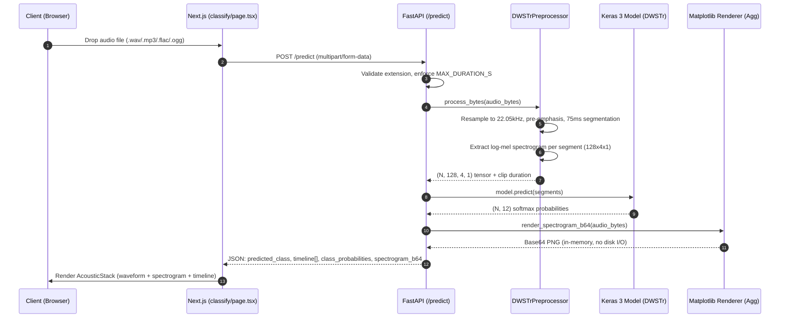

# ShipsEar-DWSTr

**A full-stack machine learning application that classifies underwater ship-radiated noise in real time, pairing a custom DWSTr architecture - depthwise-separable convolutions feeding a six-block transformer encoder - with a synchronized waveform, spectrogram, and prediction-timeline visualization pipeline.**

<p align="center">
  
  
  
  
  
  
  
  
</p>

<p align="center">
  <a href="#features">Features</a> •
  <a href="#tech-stack">Tech Stack</a> •
  <a href="#architecture">Architecture</a> •
  <a href="#project-structure">Project Structure</a> •
  <a href="#deep-dive--state-management">Deep Dive</a> •
  <a href="#getting-started">Getting Started</a> •
  <a href="#deployment--security">Deployment &amp; Security</a>
</p>

## About

ShipsEar-DWSTr classifies 12 fine-grained vessel types from hydrophone recordings in the ShipsEar dataset. The model doesn't see a clip as a whole - it segments audio into 75ms windows, extracts a log-mel spectrogram from each, and classifies every window independently before the results are aggregated. That's a deliberate architectural choice (short, high-resolution windows generalize better on a dataset this size than one global summary), but it also means a single upload produces hundreds of individual predictions, not one.

Most classification demos hide that complexity behind a single confidence score. This project doesn't: the frontend exposes the full per-segment prediction sequence as a synchronized, scrollable timeline alongside the raw waveform and the spectrogram the model actually consumed. The engineering problem that follows from that decision - rendering and interacting with a timeline that can hold thousands of prediction stripes without dropping frames - is the most involved part of the codebase and is covered in detail below.

The backend is a thin, stateless FastAPI service wrapping a Keras 3 model. It holds no database and no user accounts; a request in, a JSON response with an inference and a rendered spectrogram out.

## Features

### *Acoustic Visualization*

- **AcousticStack Pipeline** - Synchronizes three time-aligned views of one clip: a `wavesurfer.js` waveform player, a backend-rendered log-mel spectrogram image, and an HTML5 Canvas prediction timeline, all driven off a single `currentTime` value lifted to the page.
- **HTML5 Canvas Timeline** - Projects the model's `(N, 12)` prediction tensor onto a single `<canvas>` draw call instead of one DOM node per segment, so a 30-second clip (~400 segments) renders and repaints without layout thrash.
- **Normalized Zoom & Pan** - Scroll-wheel focal zooming (1×–10×) and click-to-drag horizontal panning let a user inspect micro-shifts in classification across a handful of consecutive 75ms segments.
- **Synchronized Vessel Palette** - A deterministic 12-color palette, generated once from the class list, binds each timeline stripe's color directly to that same class's bar in the aggregate probability breakdown — no re-derivation of color-to-class mapping between components.

### *Inference Engine*

- **Standalone Keras 3 Execution** - Deserializes the `.keras` v3 artifact's full architecture graph directly via `keras.models.load_model`, registering the three custom layers (`TransformerBlock`, `ClassTokenLayer`, `PositionalEmbedding`) by name rather than depending on legacy TF v2 `SavedModel` wrappers.
- **Audio Preprocessing** - `librosa`-based pipeline: resample to 22,050 Hz mono, pre-emphasis filter, 75ms non-overlapping segmentation, log-mel spectrogram extraction (128 mel bins × 4 time frames) per segment.
- **Zero-IO Spectrogram Rendering** - Renders a 250 DPI log-mel spectrogram of the full clip using `matplotlib`'s `Agg` backend and `FigureCanvasAgg` directly (not `pyplot`, which keeps non-thread-safe global figure state), encoding straight to a Base64 PNG in memory with no temp-file round trip.

## Tech Stack

### Frontend

| Technology | Purpose |
|---|---|
| Next.js 15 (App Router) | Routing, server/client component split, production build pipeline |
| React 19 | Component model, concurrent rendering for the AcousticStack |
| TypeScript | Static typing across API contracts and component props |
| Tailwind CSS 4 | Utility-first styling against a fixed dark-theme token set |
| Framer Motion | Choreographed section reveals, spectrogram fade-in |
| TanStack Query | Request lifecycle (loading/error/success) for `/predict` |
| wavesurfer.js | Waveform rendering and playback position as the timeline's clock source |
| HTML5 Canvas API | High-density segment-stripe rendering for the prediction timeline |

### Backend / APIs

| Technology | Purpose |
|---|---|
| FastAPI | Async request handling, typed request/response validation |
| Keras 3 | Model deserialization and batched inference |
| Librosa | Resampling, pre-emphasis, STFT/mel-spectrogram feature extraction |
| Matplotlib (Agg backend) | Server-side spectrogram rasterization to PNG bytes |
| Pydantic | Response schema enforcement (`PredictResponse`), automatic OpenAPI docs |
| Uvicorn | ASGI server |

### Tooling & Infrastructure

| Technology | Purpose |
|---|---|
| Docker | Reproducible backend runtime with `libsndfile1`/`ffmpeg` system deps librosa needs |
| Husky + lint-staged | Pre-commit Prettier formatting, enforced before a commit is written |
| GitHub Actions | CI: Prettier format check + frontend build check on every push/PR |
| Prettier | Canonical formatting across the frontend workspace |

## Architecture



## Project Structure

```text
.
├── backend/
│   ├── app/
│   │   ├── main.py                      # FastAPI app: CORS, /health, /predict routes
│   │   ├── model/
│   │   │   ├── infer.py                 # DWSTrService: model load, inference, spectrogram render
│   │   │   ├── layers.py                # TransformerBlock, ClassTokenLayer, PositionalEmbedding
│   │   │   └── preprocess.py            # DWSTrPreprocessor: resample, segment, log-mel extraction
│   │   └── schemas.py                   # Pydantic PredictResponse / TimelineEntry
│   ├── model_artifacts/
│   │   ├── dwstr_best_model.keras       # Trained weights + full architecture graph
│   │   ├── class_names.json             # Ordered 12-class label map
│   │   └── preprocess_config.json       # Sample rate, mel params, segment length
│   ├── Dockerfile                       # python:3.12-slim + libsndfile1 + ffmpeg
│   └── requirements.txt
├── frontend/
│   ├── app/
│   │   ├── classify/page.tsx            # Upload -> AcousticStack -> ResultsPanel flow
│   │   ├── layout.tsx                   # Root layout, font vars, QueryClientProvider
│   │   └── globals.css
│   ├── components/
│   │   ├── AcousticStack.tsx            # Composes waveform + spectrogram + timeline layers
│   │   ├── WaveformPlayer.tsx           # wavesurfer.js view; the stack's playhead clock
│   │   ├── SpectrogramDisplay.tsx       # Renders the backend's Base64 PNG
│   │   ├── SegmentTimeline.tsx          # Canvas-rendered, zoomable per-segment strip
│   │   └── ResultsPanel.tsx             # Aggregate class-probability breakdown
│   └── next.config.ts
├── package.json                         # Root: husky + lint-staged + prettier
└── README.md
```

## Deep Dive - State Management

The prediction timeline has to stay interactive - 60fps panning and zooming - while holding a `(N, 12)` tensor that can run into the thousands of segments on longer clips. Storing pan/zoom in React state and re-rendering a component tree on every wheel event doesn't get there; the timeline is built around three decisions that keep the render path out of React entirely once a clip is loaded.

**1. Algebraic projection, not stored pixels.** Pan position is tracked as a single normalized `panX` value, clamped to `[0, 1 - 1/zoom]` - never an absolute pixel offset. Pixel coordinates are computed on the fly, inside the `requestAnimationFrame` draw loop, from the container's current width:

```ts
// Runs inside the rAF loop — panX/zoom live in refs, not React state,
// so panning never triggers a component re-render.
const stripWidth = segW * zoom;
const px = i * stripWidth - panX * (stripWidth * timeline.length - containerWidth);
```

Because the offset is normalized rather than absolute, a resize (rotating a phone, resizing a window) doesn't require recomputing or rescaling stored pixel values - the same `panX` still means the same relative position at any container width.

**2. Scroll yielding.** A native `wheel` listener reads `e.deltaY`/`e.deltaX` directly rather than relying on a synthetic React event, and calls `e.preventDefault()` conditionally - only when the gesture is actually going to change zoom or pan state. At the 1× floor, the 10× ceiling, or on a purely horizontal trackpad swipe (which should scroll the page, not the timeline), the listener does nothing and lets the browser's default behavior run. Capturing every wheel event unconditionally is what makes embedded canvases feel like they've "trapped" the page's scroll — this avoids that by only intercepting the events it actually needs.

**3. Off-screen culling.** Before each `fillRect()` call, the loop checks the stripe's projected boundaries against the visible viewport:

```ts
if (px + stripWidth < 0 || px > containerWidth) continue; // fully off-screen - skip the draw call
```

At 10× zoom on a long clip, this keeps the number of actual draw calls per frame proportional to what's visible on screen, not to the total segment count.

## Getting Started

**Prerequisites**

- Node.js 20+
- Python 3.12+
- `libsndfile1` and `ffmpeg` if running the backend outside Docker (librosa's C-level dependencies)
- Docker (recommended for the backend, to avoid installing those system libraries locally)

```bash
git clone https://github.com/aridepai17/shipsear-dwstr.git
cd shipsear-dwstr

# Root tooling - husky, lint-staged, prettier (monorepo-wide pre-commit formatting)
npm install

# --- Backend ---
cd backend
python3.12 -m venv .venv && source .venv/bin/activate
pip install -r requirements.txt
cp .env.example .env            # set CORS_ORIGINS, MAX_DURATION_S, etc.
uvicorn app.main:app --reload --port 8000

# --- Frontend (new terminal) ---
cd ../frontend
npm install
cp .env.example .env.local      # NEXT_PUBLIC_API_BASE=http://localhost:8000
npm run dev
```

Backend health check: `curl http://localhost:8000/health`. Interactive API docs (from the Pydantic schemas in `schemas.py`): `http://localhost:8000/docs`.

## Deployment & Security

**Deployment.** The frontend is a standard Next.js 15 build, deployed on Vercel. The backend is containerized - librosa depends on `libsndfile1` and `ffmpeg` at the system level, which rules out most serverless function runtimes - and runs as a long-lived container on a VPS, Render, or AWS, not as an on-demand function (Keras's model load and warm-up cost make cold starts impractical there).

**Guardrails:**

- **CORS whitelisting** - FastAPI's `CORSMiddleware` restricts `/predict` and `/health` to an explicit origin list; no wildcard `*` in production.
- **Tensor expansion limiting** - `MAX_DURATION_S` rejects oversized uploads immediately after decode, before segmentation runs, bounding how large the `(N, 12)` prediction tensor can grow and preventing an unbounded upload from exhausting memory.
- **Model sandboxing** - only `.keras` v3 artifacts are loaded, never legacy `.h5`/pickled objects; the v3 format's config-based deserialization avoids the arbitrary code execution risk that comes with unpickling untrusted objects.
- **Non-blocking figure isolation** - the spectrogram renderer uses matplotlib's object-oriented `Figure`/`FigureCanvasAgg` API instead of `pyplot`'s global figure stack, so concurrent `/predict` requests can't corrupt or block on each other's plot, and `fig.clear()` is called explicitly after every render to bound memory growth.

## Connect

- GitHub - [@aridepai17](https://github.com/ariepai17)
